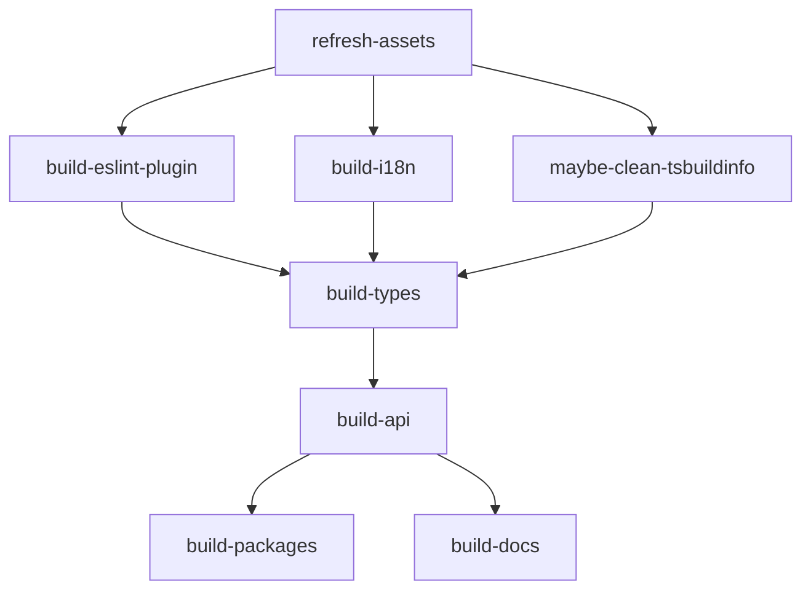

# tldraw 构建系统和开发工作流分析

## 1. 构建系统概述

### 1.1 LazyRepo 增量构建系统
tldraw 使用自定义的 LazyRepo 系统作为核心构建工具，提供高效的增量构建和缓存机制。

**核心特点：**
- **增量构建**：只构建发生变更的包
- **智能缓存**：基于文件输入/输出的缓存系统
- **并行执行**：支持并行构建任务
- **依赖管理**：自动处理包之间的依赖关系

**配置文件：** `lazy.config.ts`

### 1.2 Yarn Berry 工作区
使用 Yarn 4.x 的现代工作区功能管理 monorepo。

**配置特点：**
- 使用 `yarn.config.cjs` 强制依赖版本一致性
- 通过 `workspaces` 字段定义工作区范围
- 使用 `resolutions` 解决依赖冲突

## 2. 构建流程详解

### 2.1 构建阶段和依赖关系



#### 主要构建阶段：

1. **refresh-assets** - 资源刷新
   - 执行命令：`tsx internal/scripts/refresh-assets.ts`
   - 功能：刷新和打包静态资源（图标、字体、翻译等）
   - 输入：`assets/**/*`, `packages/*/package.json`
   - 输出：打包后的资源文件

2. **build-eslint-plugin** - ESLint插件构建
   - 位置：`internal/scripts/eslint/`
   - 功能：构建自定义ESLint规则
   - 依赖：无前置依赖

3. **build-types** - TypeScript类型构建
   - 执行命令：`tsx internal/scripts/typecheck.ts`
   - 功能：增量类型检查和.d.ts文件生成
   - 输入：所有`.ts/.tsx`文件
   - 输出：`.tsbuildinfo`和`.tsbuild/`目录

4. **build-api** - API文档生成
   - 功能：基于.d.ts文件生成API文档
   - 依赖：build-types阶段完成
   - 输出：`api/**/*`文档文件

5. **build-i18n** - 国际化构建
   - 功能：编译国际化文件
   - 输入：`apps/dotcom/client/public/tla/locales/*.json`
   - 输出：编译后的语言包

### 2.2 包构建策略

#### Packages构建：
```typescript
'packages/*': {
  runsAfter: {
    'build-api': { in: 'self-only' },
    prebuild: { in: 'self-only' }
  },
  cache: {
    inputs: ['api/**/*', 'src/**/*'],
  },
}
```

#### Docs应用构建：
```typescript
'apps/docs': {
  runsAfter: { 'build-api': { in: 'all-packages' } },
  cache: {
    inputs: [
      'app/**/*', 'api/**/*', 'components/**/*',
      'public/**/*', 'scripts/**/*', 'styles/**/*',
      'types/**/*', 'utils/**/*'
    ],
  },
}
```

## 3. 开发工作流

### 3.1 开发环境启动

#### 主要开发命令：

1. **yarn dev** - 主开发环境
   ```bash
   yarn dev  # 启动examples应用和相关依赖包
   ```
   - 过滤器：`apps/examples`, `packages/tldraw`, `apps/bemo-worker`, `apps/dotcom/image-resize-worker`
   - 执行模式：independent（独立并行）
   - 缓存：none（开发不使用缓存）

2. **yarn dev-app** - tldraw.com开发
   ```bash
   yarn dev-app  # 启动dotcom应用
   ```
   - 过滤器：`apps/dotcom/*`, `packages/tldraw`
   - 包含所有dotcom子应用

3. **yarn dev-docs** - 文档开发
   ```bash
   yarn dev-docs  # 启动文档站点
   ```

4. **yarn dev-vscode** - VSCode扩展开发
   ```bash
   yarn dev-vscode  # 启动VSCode扩展开发
   ```

### 3.2 测试工作流

#### 测试命令：

1. **单元测试**
   ```bash
   yarn test run           # 运行测试
   yarn test run --grep "pattern"  # 过滤测试
   yarn test-ci            # CI模式测试
   yarn test-coverage      # 生成覆盖率报告
   ```

2. **E2E测试**
   ```bash
   yarn e2e                # examples应用E2E测试
   yarn e2e-dotcom         # dotcom应用E2E测试
   yarn e2e-dotcom-x10     # 并行E2E测试
   ```

### 3.3 代码质量工作流

#### 质量检查命令：

1. **lint检查**
   ```bash
   yarn lint               # 代码风格检查
   ```

2. **类型检查**
   ```bash
   yarn typecheck          # 全量类型检查
   ```
   - 包含资源刷新步骤
   - 使用自定义类型检查脚本

3. **格式化**
   ```bash
   yarn format             # 代码格式化
   yarn format-current     # 格式化变更文件
   ```

4. **API一致性检查**
   ```bash
   yarn api-check          # 公共API一致性验证
   ```

## 4. 内部脚本系统

### 4.1 脚本组织结构

```
internal/
├── scripts/           # 核心构建和工具脚本
│   ├── clean.sh
│   ├── context.ts
│   ├── refresh-context.ts
│   ├── refresh-assets.ts
│   ├── typecheck.ts
│   └── api-check.ts
├── config/           # 共享配置
└── dev-tools/        # 开发工具
```

### 4.2 关键脚本说明

#### refresh-assets.ts
- **功能**：同步和打包静态资源
- **处理资源**：图标、字体、翻译文件、CSS等
- **输出目标**：各个packages的dist目录

#### typecheck.ts
- **功能**：增量TypeScript编译
- **特性**：智能依赖追踪
- **输出**：.d.ts文件和.tsbuildinfo

#### api-check.ts
- **功能**：验证公共API一致性
- **基于**：Microsoft API Extractor
- **检查项**：导出完整性、类型签名一致性

## 5. CI/CD和自动化

### 5.1 Git Hooks
使用 Husky 管理 Git hooks：
```json
{
  "postinstall": "husky install && yarn refresh-assets"
}
```

### 5.2 缓存策略

#### LazyRepo缓存：
- **基础缓存配置**：包含package.json、yarn.lock等核心文件
- **排除模式**：coverage、dist、.next等构建产物
- **缓存级别**：
  - 构建任务：智能缓存
  - 开发任务：无缓存
  - E2E测试：无缓存

#### 依赖版本一致性：
```javascript
// yarn.config.cjs
function enforceConsistentDependenciesAcrossTheProject({ Yarn }) {
  // 强制所有工作区使用相同版本的依赖
  for (const dependency of Yarn.dependencies()) {
    // ...版本统一逻辑
  }
}
```

## 6. 性能优化

### 6.1 增量构建优化
- **文件监听**：只处理变更的文件
- **依赖图优化**：最小化重新构建范围
- **并行执行**：独立任务并行运行

### 6.2 TypeScript优化
- **项目引用**：使用TypeScript项目引用
- **增量编译**：基于.tsbuildinfo的增量编译
- **类型检查隔离**：独立的类型检查阶段

### 6.3 资源优化
- **资源打包**：预打包静态资源
- **Tree Shaking**：自动死代码消除
- **代码分割**：动态导入和代码分割

## 7. 开发体验优化

### 7.1 热重载
- **Vite HMR**：开发环境热重载
- **React Fast Refresh**：组件状态保持
- **样式热更新**：CSS即时更新

### 7.2 开发工具集成
- **ESLint集成**：实时代码检查
- **Prettier集成**：自动代码格式化
- **TypeScript集成**：实时类型检查

### 7.3 调试支持
- **Source Maps**：完整的源码映射
- **React DevTools**：组件调试
- **Redux DevTools**：状态调试

## 8. 最佳实践

### 8.1 开发流程
1. 创建功能分支
2. 运行`yarn dev`启动开发环境
3. 编写代码和测试
4. 运行`yarn typecheck`和`yarn lint`
5. 提交前自动运行hooks检查
6. 创建PR进行代码审查

### 8.2 性能考虑
- 使用workspace:*依赖确保内部包版本一致
- 避免全量构建，优先使用增量构建
- 合理配置缓存策略

### 8.3 维护建议
- 定期更新依赖版本
- 监控构建性能指标
- 保持脚本和配置的可读性

这个构建系统体现了现代前端工程化的最佳实践，通过工具链整合、自动化和缓存优化，提供了高效的开发和构建体验。